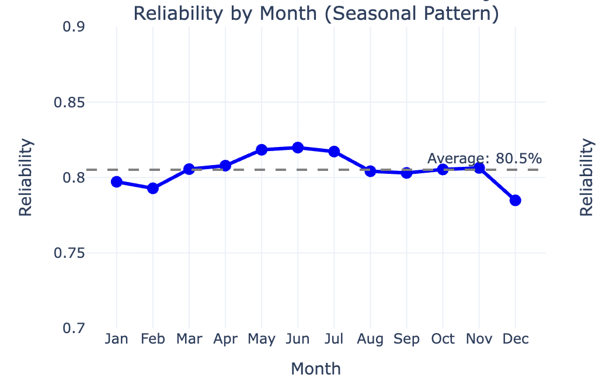
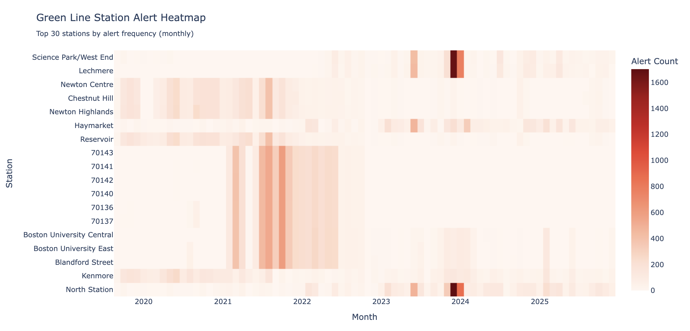
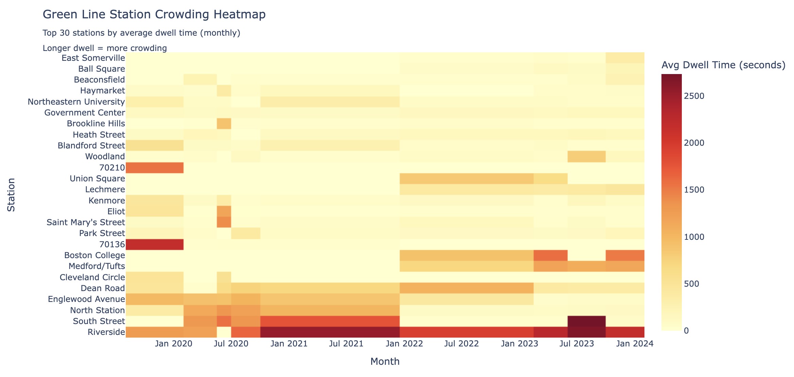
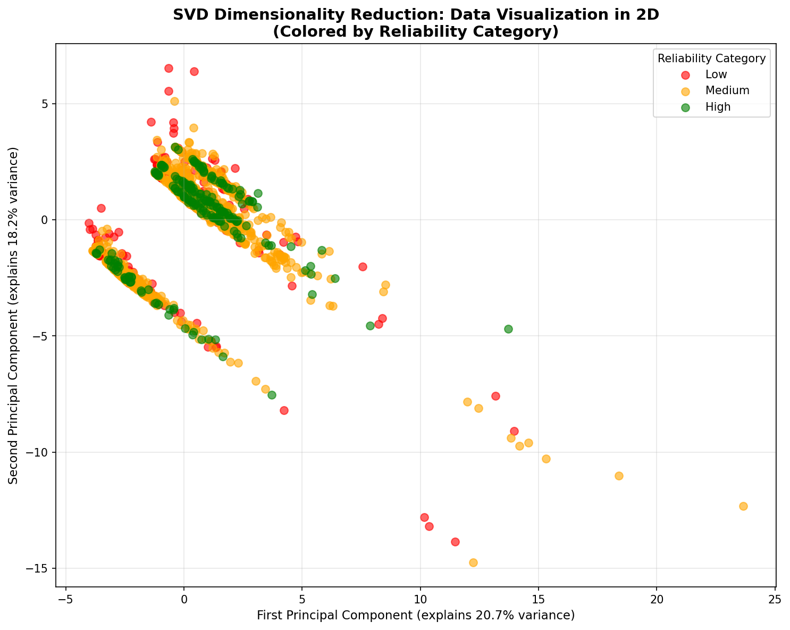

# 506MBTAProject
## Project Repository for CS5066

**CS 506 Final Project**

Video: 


## Project Overview

Our project aims to predict when the Green Line will have reliability issues and identify crowding hotspots, so students can plan their commutes better.

**The Problem**: Students at specific stops and times significantly contribute to MBTA train delays. We wanted to predict surges in passenger volume on the MBTA Green Line and create a tool that students can use while commuting.

**The Goal**: Identify transit crowd hotspots with high accuracy and visualize them so students can avoid delays and plan when to take the T.

---

## How to Build and Run

1. **Install dependencies:**
   ```bash
   make install
   # Or manually: pip install -r requirements.txt
   ```

4. **Run the full pipeline:**
   ```bash
   make all
   ```
   This will: install dependencies → download/process data → run tests → generate visualizations

### Project Structure

```
506MBTAProject/
├── src/                   # Source code
│   ├── mbta/              # MBTA data processing
│   │   ├── class_schedules.py    # BU class schedule patterns
│   │   ├── historical.py         # Reliability data processing
│   │   ├── weather.py            # Weather data processing
│   │   ├── merging.py            # Data merging pipeline
│   │   ├── mbta.py              # MBTA API utilities
│   │   └── stop_names.py        # Stop ID to name mapping
│   ├── models/            # Modeling code
│   │   ├── feature_engineering.py  # Feature creation (119 features)
│   │   └── model.py               # Final model (Random Forest)
│   └── integration/      # Data integration
│       ├── lamp_data_integration.py   # LAMP performance data
│       └── lamp_alerts_integration.py # LAMP alerts data
├── scripts/               # Utility scripts
│   └── download_more_lamp_data.py
├── notebooks/             # Analysis notebooks
│   └── analysis.ipynb
├── visualization/         # Interactive visualizations
│   └── mbta_map_viz.py
├── tests/                 # Test files
├── output/                # Generated visualizations
├── data/                  # Data files (cleaned CSVs included, raw data excluded)
├── Makefile               # Build automation
├── requirements.txt       # Python dependencies
└── README.md              # This file
```

## Final Results

### Patterns


### Station Alert Heatmap

*Top 30 stations by alert frequency, showing which stations have the most service disruptions*

### Station Crowding Heatmap

*Top 30 stations by average dwell time (crowding proxy), showing passenger volume hotspots*


### Model Performance

**Best Model: Random Forest Classifier**
- **Accuracy: 70.6%** (predicting High/Medium/Low reliability)
- Model: Random Forest with 300 trees, max_depth=6
- Features: 20 selected using mutual information
- Train/Test Split: Temporal (2019-2022 train, 2023-2024 test)

**Top 5 Predictive Features:**
1. Month (0.102) - Strong seasonal patterns
2. Snow rolling 3-day average (0.093) - Recent snow patterns matter
3. Snow volatility (0.091) - Snow std over 7 days
4. Alert frequency (0.083) - Days since last alert
5. Alert patterns (0.070) - Monthly alert patterns

**SVD Dimensionality Reduction Visualization:**

Applied SVD using PCA to reduce the 20-dimensional feature space to 2D




### What we found

1. **Weather alone explains only 3.7% of reliability variance**
   - Weather is not the main factor of reliability issues.

2. **Seasonal patterns**
   - Month is the #1 predictor
   - Winter months (Jan-Feb) have lower reliability
   - This makes sense - snow, cold weather, more disruptions

3. **Snow patterns**
   - Recent snow (3-day average) is more predictive than today's snow
   - Snow volatility (how much it varies) is also important

4. **Alert frequency**
   - Stations with recent alerts are more likely to have reliability issues
   - Pattern learning from alerts helps predict future problems

5. **Time-series**
   - Lag features and rolling averages capture important patterns
   - Simple features miss these temporal relationships


### Collected Data

1. **MBTA Reliability Data** (2016-2024)
   - Source: [MBTA ArcGIS OpenData](https://mbta-massdot.opendata.arcgis.com/datasets/MassDOT::mbta-bus-commuter-rail-rapid-transit-reliability/about)
   - Contains: Daily reliability percentages for Green Line B
   - Manual download required

2. **Weather Data** (2016-2024)
   - Source: [Visual Crossing API](https://www.visualcrossing.com/)
   - Contains: Precipitation, snow, temperature, humidity, etc.
   - Downloaded automatically via `make data`

3. **BU Class Schedule Patterns**
   - Source: BU standard class meeting times
   - Contains: MWF and TR class start times (8am, 10am, 12pm, 2pm, 4pm)
   - Encoded in `src/mbta/class_schedules.py`

4. **MBTA LAMP Performance Data** (2019-2024)
   - Source: [MBTA Performance Data Portal](https://performancedata.mbta.com/)
   - Contains: Headway, dwell time, travel time metrics
   - Downloaded automatically via `make data`

5. **MBTA LAMP Alerts Data** (2019-2025)
   - Source: MBTA LAMP alerts system
   - Contains: 4.1M alert records (construction, maintenance, technical problems)
   - Downloaded automatically via `make data`

### Data Processing

- Standardized datetime formats across all datasets
- Handled missing values (filled with zeros where appropriate)
- Filtered for Green Line routes only
- Aggregated to daily level (since reliability data is daily)
- Created temporal features (day of week, month, hour)
- Merged all datasets on date

---

## Feature Engineering

Created 119 features total, then selected the top 20 using mutual information:

### Feature Categories

1. **Temporal Features**
   - Day of week, month, hour
   - is_weekend, is_monday
   - Semester patterns (fall/spring/summer)

2. **Weather Features**
   - Current: precip, snow, snowdepth
   - Lagged: snow_lag_1d, snow_lag_7d
   - Rolling averages: snow_rolling_3d, snow_rolling_7d
   - Volatility: snow_std_7d

3. **Class Schedule Features**
   - Morning class starts (8am-10am)
   - Afternoon class starts (12pm-3pm)
   - Total class starts per day

4. **Alert Features**
   - Daily counts: construction_alerts, technical_problem_alerts, total_alerts
   - Lagged: total_alerts_lag_1d, total_alerts_lag_7d
   - Rolling averages: total_alerts_rolling_7d, total_alerts_rolling_14d
   - Patterns: alert_pattern_month, days_since_last_alert

5. **Interaction Features**
   - snow_x_classes (snow × class starts)
   - alerts_x_classes (alerts × class starts)

### Feature Selection

Used mutual information to select the top 20 features. This helped reduce overfitting and improve model performance.
